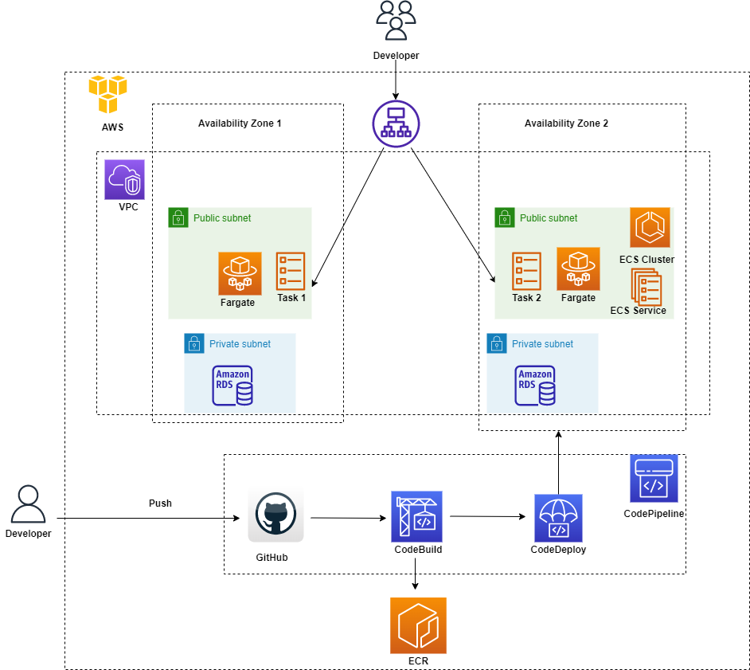

# Servian DevOps Tech Challenge - Tech Challenge App

## 1. Tech challenge overview
The scope of this challenge is to deploy a simple GTD application backed by a PostgreSQL database into a cloud environment of choice (AWS, Azure, or GCP).

## 2. Solution approach and choice of technologies

### AWS 
AWS will be used as the cloud provider as it is one of the leading cloud platforms in the market and I also have some hands-on experience with AWS.

### ECS and Fargate
ECS will be used for Docker container orchestration. While I have my expertise in Kubernetes, I am exploring Fargate as part of this challenge to understand more about its of ease of use.

### Terraform
I will also be experimenting with usage of Terraform which provides Infrastructure as a Code. I have recently started exploring Terraform so this challenge will be a good opportunity for me to try  using it to create, manage and also destroy AWS resources.

### RDS
Aurora PostGresSQL will be used to provision the database in two availability zones to achieve high availability. 

### CodePipeline
Codepipeline will be used for automated deployment with Continuous Integration and Continuous Delivery (CI/CD). GitHub will be used for the source code management and a push to master will trigger CodeBuild. 

### Application Load Balancer (ALB)
ALB will be used for load balancing and auto-scaling.

### High Availability
We will use 2 availability zones under the same region. Keeping our resources in more than one zone is important to achieve high availability and to ensure your application is resilient to one zone failure
 
### Networking (VPC and Subnets)
1 VPC with 2 subnets will be created in each availability zone.

### AWS Identity and Access Management (IAM)
IAM will be used to access control across services and resources of AWS

## 3. High level architecture diagram

Current Architecture for the scope of this challenge 

Desired Architecture

## 4. Deployment steps
###Automated deployment - Github Push action will trigger the Codepipeline
1. Ccode is pushed to master branch

2. CodePipeline gets the code in the Source stage and calls the Build stage (CodeBuild).

3. Build stage will process our Dockerfile and push the Image to ECR followed by triggering the Deploy stage

4. Deploy stage updates our ECS with the new image

### Manual deployment - Terraform installation is a pre-requisite. 

#### terraform init
Initialize terraform using this command

#### terraform plan
This command will help to understand the execution plan and which AWS resources will be deployed.

#### terraform apply
All AWS resources configured will be provisioned as part of this step

#### terraform destroy
All AWS resources created in previous steps can be destroyed using this command. It is a good practice to delete resources if not in use to avoid additional costs.

## 5. Improvements

1. Tests can be added to check success and failure of CodePipeline executions

2. Checks can be added in Terraform AWS resource configs to prevent deletion based on a variable like environment = production so that terraform destroy does not accidently delete

## 6. Alternatives

1. GitHub actions is another widely used alternative to CodeBuild. 